# PrintXpress — Digital Printing Service App

<p align="center">
  
</p>

<p align="center">
  <b>Native Android printing marketplace app powered by Supabase (PostgreSQL)</b>
</p>

---

## Table of Contents

1. [Introduction](#1-introduction)
2. [Features](#2-features)
3. [System Requirements](#3-system-requirements)
4. [Installation Guide](#4-installation-guide)
5. [User Manual](#5-user-manual)
6. [Screenshots](#6-screenshots)
7. [Architecture Overview](#7-architecture-overview)
8. [Technology Stack](#8-technology-stack)
9. [Project Structure](#9-project-structure)
10. [Database Design](#10-database-design)
11. [UML Diagrams](#11-uml-diagrams)
    - [Use Case Diagram](#use-case-diagram)
    - [System Architecture Diagram](#system-architecture-diagram)
    - [Component Diagram](#component-diagram)
    - [Deployment Diagram](#deployment-diagram)
    - [Class Diagram](#class-diagram)
    - [Sequence Diagrams](#sequence-diagrams)
    - [Activity Diagram](#activity-diagram)
    - [State Machine Diagram](#state-machine-diagram)
    - [Package Diagram](#package-diagram)
    - [Data Model / ER Diagram](#data-model--er-diagram)
12. [Security](#12-security)
13. [Validation](#13-validation)
14. [API Reference](#14-api-reference)
15. [Performance Optimization](#15-performance-optimization)
16. [Setup Instructions](#16-setup-instructions)
17. [Build Instructions](#17-build-instructions)
18. [Testing](#18-testing)
19. [Troubleshooting](#19-troubleshooting)
20. [Future Enhancements](#20-future-enhancements)
21. [Author and Credits](#21-author-and-credits)

---

## 1. Introduction

**PrintXpress** is a mobile-first digital printing service. Customers can use it to browse and order printed products such as business cards, flyers, posters, banners, and more. The app runs on Android phones and tablets. It stores all user accounts, products, orders, and designs in a cloud database called **Supabase**.

The app is built using **Java** and the **MVVM** design pattern. It connects to the internet through the **Retrofit** library and uses **Material Design** components for a clean and modern user interface.

### Why this app?

Traditional printing shops often require phone calls or in-person visits. PrintXpress lets customers:
- Browse products from anywhere.
- Customize their order inside the app.
- Track order history.
- Save designs for later.
- Receive clear success and error messages.

This makes the process faster, easier, and more reliable.

---

## 2. Features

### Account and Authentication
- Register a new account with username, name, phone, email, address, and password.
- Log in with **email** or **username**.
- Log in with **Google Sign-In**.
- Reset forgotten password.
- Automatic login when the app is reopened.
- Automatic token refresh so users stay logged in.

### Product Browsing
- Browse a list of printable products.
- Filter products by category: All, Business Cards, Flyers, Posters, Banners.
- View product name, category, price, and specifications.
- Empty state shown when no products match.

### Order Customization
- Choose paper type (Matte Cardboard, Glossy Paper, Satin Photo Paper, Vinyl).
- Choose size (Standard, A5 Booklet, A2 Poster, 3x6ft Banner).
- Choose delivery method (Home Delivery, Express Courier, Store Pickup).
- Enter quantity and see total price update live.
- Add custom printed text.
- Add a design URL.
- Schedule a pickup time for store pickup.

### Order Management
- Place an order and save it to the cloud.
- View all previous orders.
- Cancel an order while it is still **PENDING**.
- Reschedule a store pickup time.

### Saved Designs and Gallery
- Save a custom design for later use.
- View sample templates from the Sample Gallery.
- Apply templates to a product order.

### Profile and Admin
- View and edit profile details.
- Admin users can open the Admin Panel to manage products, orders, samples, promotions, and FAQs.

### Performance and UX
- Lightweight release APK (~3–4 MB).
- Smooth scrolling using `RecyclerView`.
- Clear success and error `Toast` messages.
- Modern category filter buttons.
- Popup navigation menu.

---

## 3. System Requirements

| Requirement | Minimum Value |
|-------------|---------------|
| Operating System | Android 7.0 (API level 24) or higher |
| RAM | 2 GB or more |
| Storage | 40 MB free space |
| Internet | Mobile data or Wi-Fi required |
| Google Play Services | Required for Google Sign-In |

---

## 4. Installation Guide

### Method A — Install the APK

1. Download the `PrintXpress.apk` file from the **GitHub Releases** page.
2. Open the downloaded file on your Android device.
3. If the phone asks for permission, tap **Settings** and allow **Install from this source**.
4. Tap **Install**.
5. Open the app from the home screen.

### Method B — Build from Source

1. Open the `android` folder in Android Studio.
2. Wait for Gradle sync to finish.
3. Run **Run > Run 'app'** or press `Shift + F10`.
4. Choose a connected device or emulator.

---

## 5. User Manual

This section explains how a normal user uses the app, step by step.

### 5.1 Open the App

When you open PrintXpress:
- If you are already logged in, the app shows the product list.
- If you are not logged in, the app shows the login screen.

### 5.2 Register a New Account

1. Tap **Register** or **Sign Up**.
2. Fill in all fields:
   - **Username** — must be unique.
   - **Full Name** — your name.
   - **Phone Number** — 10 to 15 digits.
   - **Email** — a valid email address.
   - **Address** — your delivery address.
   - **Password** — at least 6 characters.
3. Tap **Register**.
4. If everything is correct, you will see:  
   **“Registration successful! Welcome.”**
5. The app automatically takes you to the product list after a short delay.

### 5.3 Log In

1. Enter your **email** or **username**.
2. Enter your **password**.
3. Tap **Log In**.
4. You can also tap **Sign in with Google** to log in using your Google account.

### 5.4 Browse Products

- The product list is the main screen.
- At the top you will see category buttons:
  - **All**
  - **Business Cards**
  - **Flyers**
  - **Posters**
  - **Banners**
- Tap a button to filter products.
- Tap any product to see details.
- If no products are available, the screen shows:  
  **“No products found in this category.”**

### 5.5 View Product Details

- The product detail screen shows the product name, category, price, and description.
- Tap **Add to Order** to start ordering.

### 5.6 Place an Order

1. On the order summary screen:
   - Choose **paper type**.
   - Choose **size**.
   - Choose **delivery method**.
   - If you choose **Store Scheduled Pickup**, a pickup time box appears.
   - Enter **quantity**. The total price updates automatically.
   - Enter any **custom text** you want printed.
   - Paste a **design URL** if you have one.
2. Tap **Place Order**.
3. You will see:  
   **“Order placed successfully!”**
4. The app returns to the product list.

### 5.7 Save a Design

1. On the order summary screen, enter custom text or a design URL.
2. Tap **Save Design**.
3. The design is saved to your profile.

### 5.8 View Saved Designs

1. Tap the **menu (≡)** button on the product list.
2. Tap **Saved Designs**.
3. Tap a saved design to load it into a new order.

### 5.9 View Order History

1. Open the menu.
2. Tap **My Orders**.
3. You will see a list of your orders.
4. For pending orders you can:
   - Tap **Cancel Order** to delete it.
   - Tap **Reschedule Pickup** to change the pickup time.

### 5.10 Edit Profile

1. Open the menu.
2. Tap **My Profile**.
3. Update your details.
4. Tap **Save**.

### 5.11 Menu Options

The menu button on the product list gives quick access to:
- **My Profile**
- **Saved Designs**
- **Sample Gallery**
- **FAQs & Support**
- **My Orders**
- **Notifications & Alerts**
- **Admin Panel** (only visible for admin users)
- **Logout**

### 5.12 Admin Features

Admin users can open the Admin Panel to:
- Add, update, and delete products.
- View and manage all orders.
- Add sample templates.
- Add promotions.
- Manage FAQ articles.

---

## 6. Screenshots

<p align="center">
  
  
</p>

*(Replace `app-icon.jpg` and `screen.png` with your actual app images.)*

---

## 7. Architecture Overview

The app follows the **MVVM** pattern and the **Repository** pattern. This means the code is organized into clear layers.

- **UI Layer (`ui`)** — Activities and layouts that the user sees.
- **ViewModel Layer (`viewmodel`)** — Holds data for the UI and connects the UI to repositories.
- **Repository Layer (`data/repository`)** — Handles data fetching and saving logic.
- **Remote Layer (`data/remote`)** — Retrofit interfaces for talking to Supabase.
- **Model Layer (`data/model`)** — Simple Java classes for data (User, Product, Order, etc.).
- **Utility Layer (`util`)** — Session management and validation helpers.

```
User Interface  →  ViewModel  →  Repository  →  Retrofit API  →  Supabase Database
```

This separation makes the code easier to test, maintain, and extend.

---

## 8. Technology Stack

| Layer | Technology |
|-------|------------|
| Programming Language | Java |
| Mobile Platform | Android (API 24+) |
| Build Tool | Gradle |
| IDE | Android Studio |
| Architecture | MVVM (Model-View-ViewModel) |
| UI Components | RecyclerView, CardView, ConstraintLayout, Material Design |
| Networking | Retrofit 2, OkHttp, Gson |
| Authentication | Supabase Auth, Google Sign-In |
| Database | PostgreSQL (via Supabase) |
| API Access | Supabase PostgREST |
| Session Storage | SharedPreferences |
| Image Loading | Native Android components |

---

## 9. Project Structure

```
Asna_app/
├── android/                       # Android Studio project
│   └── app/src/main/java/com/printxpress/android/
│       ├── data/
│       │   ├── model/             # User, Product, PrintOrder, AuthUser, etc.
│       │   ├── remote/            # SupabaseClient, SupabaseAuthApi, SupabaseDataApi
│       │   └── repository/      # AuthRepository, ProductRepository, OrderRepository
│       ├── ui/
│       │   ├── auth/              # LoginActivity, RegisterActivity, ForgotPasswordActivity
│       │   ├── product/           # ProductListActivity, ProductDetailActivity
│       │   ├── order/             # OrderSummaryActivity, OrderHistoryActivity
│       │   ├── profile/           # ProfileActivity
│       │   ├── design/            # SavedDesignsActivity
│       │   ├── gallery/           # SampleGalleryActivity
│       │   ├── resources/         # ResourcesActivity
│       │   ├── notification/      # NotificationsActivity
│       │   └── admin/             # AdminDashboard, AdminProducts, AdminOrders, etc.
│       ├── util/                  # SessionManager, ValidationUtils
│       ├── viewmodel/             # AuthViewModel, ProductViewModel, OrderViewModel
│       ├── PrintXpressApp.java
│       └── MainActivity.java
│       └── res/                   # Layouts, strings, colors, drawables
├── supabase_setup.sql             # Full database schema + seed data
├── .env.example                   # Example configuration values
├── .gitignore                     # Ignores keystore, APK, secrets
├── README.md                      # This documentation
├── app-icon.jpg                   # App icon for README
└── screen.png                     # Screenshot for README
```

---

## 10. Database Design

The database is a PostgreSQL database hosted on Supabase. It contains the following tables.

### 10.1 Tables

| Table | Purpose |
|-------|---------|
| `profiles` | Stores user details (username, name, phone, email, address, role). |
| `products` | Stores printable products (business cards, flyers, posters, banners). |
| `print_orders` | Stores customer orders with items, status, delivery, and pricing. |
| `saved_designs` | Stores designs saved by users for reuse. |
| `samples` | Stores sample templates shown in the Sample Gallery. |
| `promotions` | Stores promotional offers. |
| `resources` | Stores FAQ and support articles. |

### 10.2 Relationships

- One user (`profiles`) can place many orders (`print_orders`).
- One order (`print_orders`) contains one or more order items stored as JSON.
- Each order item references a product from `products`.
- One user can have many saved designs (`saved_designs`).

### 10.3 Row Level Security (RLS)

Supabase RLS policies protect the data:
- A user can read and update only their own profile and orders.
- Products and samples can be read by anyone but modified only by admins.
- Anonymous users cannot insert orders or profiles.

---

## 11. UML Diagrams

This section shows the main diagrams that explain how the app is designed and how it works.

### Use Case Diagram

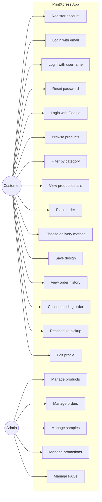

### System Architecture Diagram

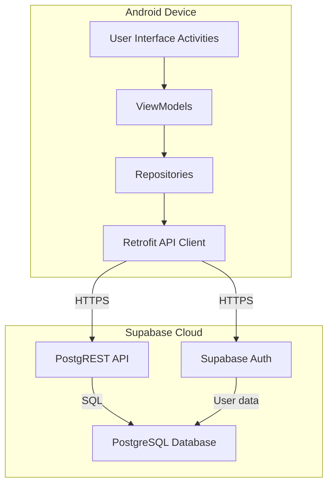

### Component Diagram

```mermaid
graph LR
    subgraph Android App
        A[Auth Components<br/>Login, Register, Forgot, Google]
        P[Product Components<br/>List, Detail, Categories]
        O[Order Components<br/>Summary, History]
        U[User Components<br/>Profile, Saved Designs, Gallery]
        AD[Admin Components<br/>Dashboard, Management]
    end

    subgraph Data Layer
        R[Repositories]
        API[Supabase Auth & Data APIs]
    end

    A --> R
    P --> R
    O --> R
    U --> R
    AD --> R
    R --> API
```

### Deployment Diagram

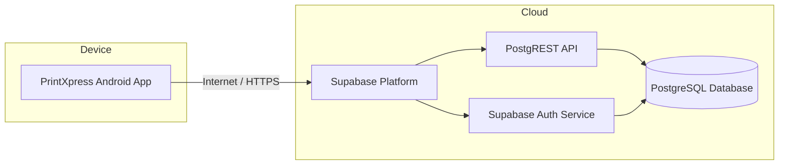

### Class Diagram

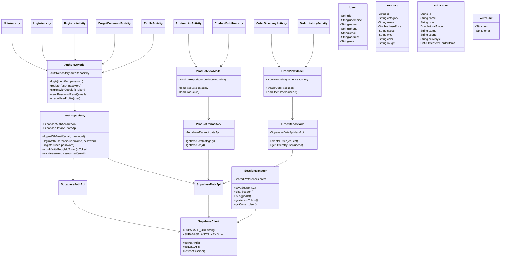

### Sequence Diagrams

#### Sequence 1: Register a New User

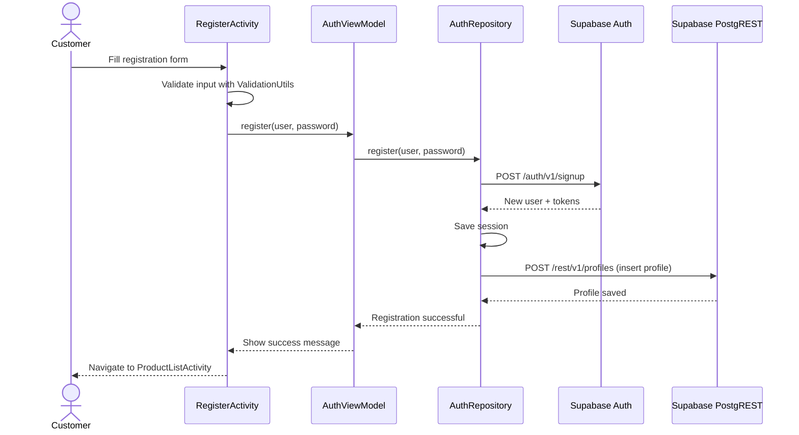

#### Sequence 2: Login with Username

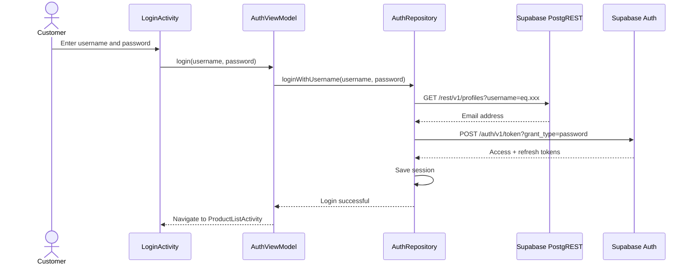

#### Sequence 3: Place an Order

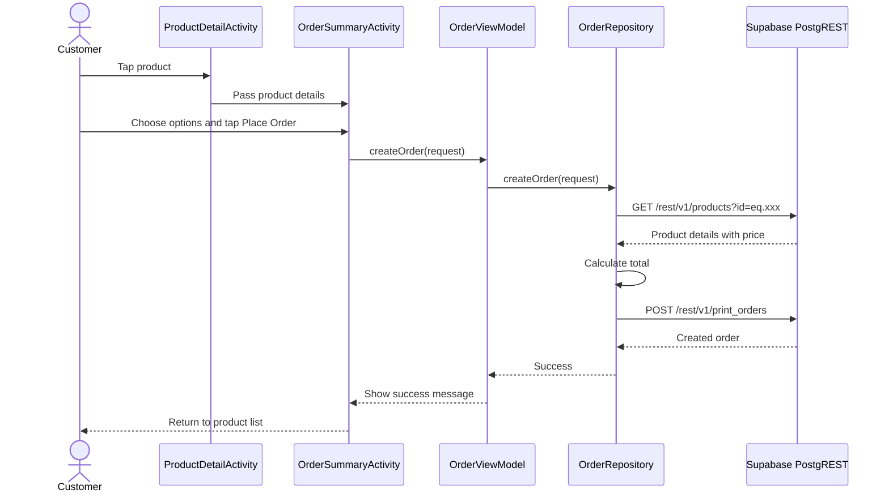

#### Sequence 4: Browse Products

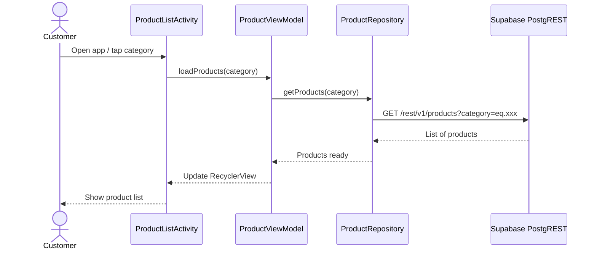

### Activity Diagram

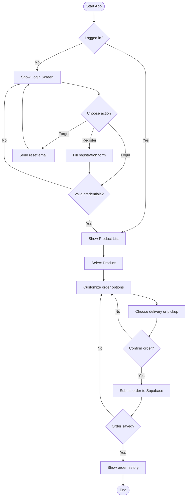

### State Machine Diagram

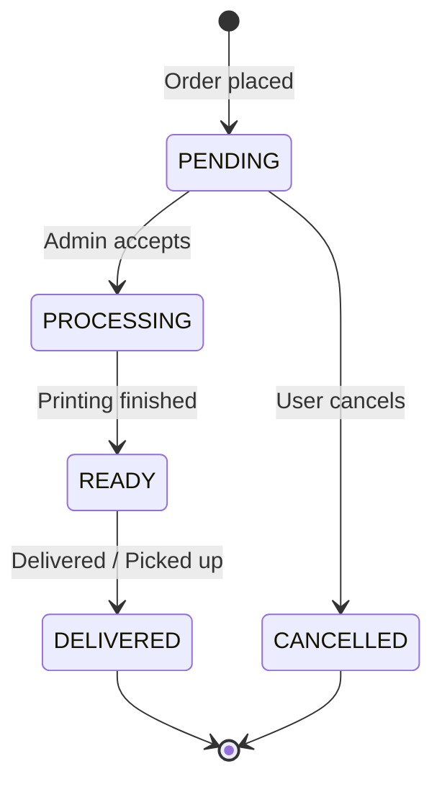

### Package Diagram

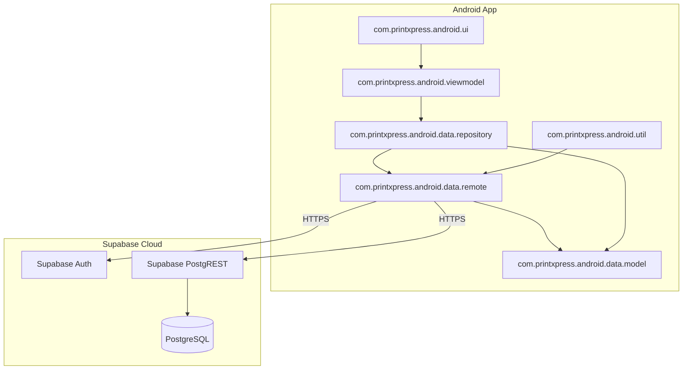

### Data Model / ER Diagram

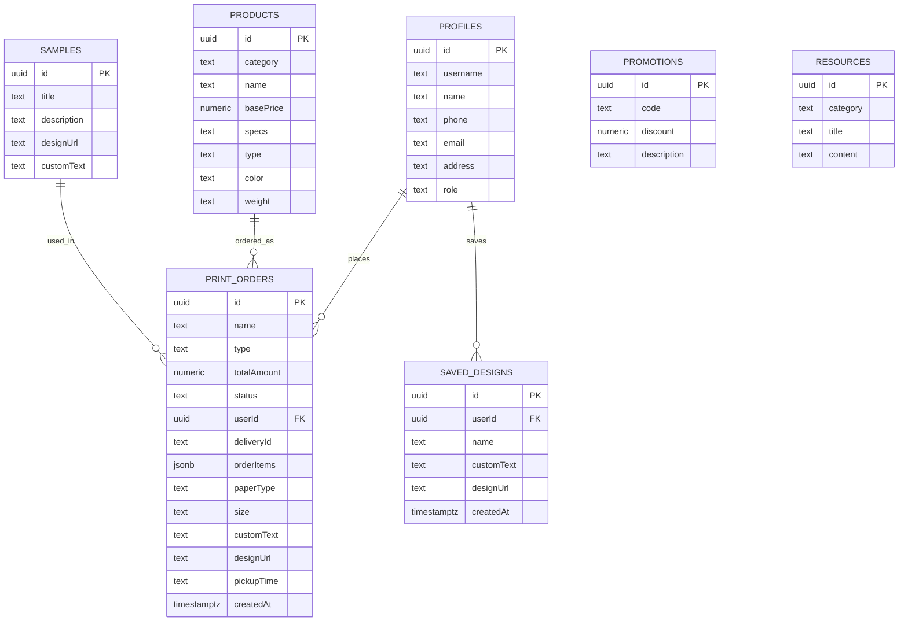

---

## 12. Security

- **Supabase Auth** stores and manages all passwords. Passwords are never saved in plain text.
- **JWT access tokens** are used for every database request.
- **Automatic token refresh** happens when the access token is about to expire.
- **Row Level Security (RLS)** policies make sure users can only access their own data.
- **HTTPS** is used for all network communication.
- The app only uses the **anon/public key** from Supabase. The **service role key** is never included in the app because it would bypass all security rules.

---

## 13. Validation

Validation happens in several places to stop bad data from entering the system.

### Client-side Validation (inside the app)

- Empty fields are checked before sending.
- Email must match a real email pattern.
- Phone number must be 10 to 15 digits.
- Password must be at least 6 characters.
- Order quantity must be 1 or more.

### Server-side Validation (in Supabase)

- `username` must be unique.
- `id` columns are primary keys (no duplicates, no empty values).
- `userId` in orders is a foreign key to `profiles.id`.
- RLS policies prevent unauthorized reads and writes.

---

## 14. API Reference

The app uses the following Supabase endpoints through Retrofit.

| Action | Method | Endpoint |
|--------|--------|----------|
| Register | POST | `/auth/v1/signup` |
| Login | POST | `/auth/v1/token?grant_type=password` |
| Google Login | POST | `/auth/v1/token?grant_type=id_token` |
| Refresh Token | POST | `/auth/v1/token?grant_type=refresh_token` |
| Reset Password | POST | `/auth/v1/recover` |
| Get Products | GET | `/rest/v1/products` |
| Create Order | POST | `/rest/v1/print_orders` |
| Get Orders | GET | `/rest/v1/print_orders?userId=eq.{id}` |
| Update Order | PATCH | `/rest/v1/print_orders?id=eq.{id}` |
| Delete Order | DELETE | `/rest/v1/print_orders?id=eq.{id}` |
| Upsert Profile | POST | `/rest/v1/profiles` |
| Get Profile | GET | `/rest/v1/profiles?id=eq.{id}` |
| Save Design | POST | `/rest/v1/saved_designs` |
| Get Samples | GET | `/rest/v1/samples` |
| Get Promotions | GET | `/rest/v1/promotions` |
| Get Resources | GET | `/rest/v1/resources` |

---

## 15. Performance Optimization

- **ProGuard** removes unused Java classes and methods from the release APK.
- **shrinkResources** removes unused images and layout files.
- **RecyclerView** reuses item views, so long product lists scroll smoothly.
- **LiveData / ViewModel** only updates the screen when data changes, avoiding unnecessary work.
- **SharedPreferences** stores session data locally so the user does not need to log in every time.
- **Retrofit + OkHttp** efficiently handles HTTP requests and responses.

Result: the release APK is reduced from about 6–7 MB to approximately **3–4 MB**.

---

## 16. Setup Instructions

### 16.1 Supabase Setup

1. Go to [supabase.com](https://supabase.com) and create a free project.
2. Open **SQL Editor → New query**.
3. Copy the contents of [`supabase_setup.sql`](supabase_setup.sql) and click **Run**.
   - This creates all tables, RLS policies, and sample data.
4. Go to **Authentication → Providers** and enable:
   - **Email** provider
   - **Google** provider (add your Google Web Client ID and Secret)
5. Copy your **Project URL** and **Anon Key** from **Settings → API**.

### 16.2 Android Setup

1. Open the `android` folder in Android Studio.
2. Open `app/src/main/java/com/printxpress/android/data/remote/SupabaseClient.java`.
3. Replace the placeholders:
   ```java
   public static final String SUPABASE_URL = "https://YOUR_PROJECT.supabase.co/";
   public static final String SUPABASE_ANON_KEY = "YOUR_ANON_KEY";
   ```
4. For Google Sign-In, open `res/values/strings.xml` and add:
   ```xml
   <string name="default_web_client_id">YOUR_WEB_CLIENT_ID</string>
   ```
5. Sync Gradle and build the project.

---

## 17. Build Instructions

### Debug Build

Windows:
```powershell
cd android
.\gradlew.bat assembleDebug
```

Mac / Linux:
```bash
cd android
./gradlew assembleDebug
```

### Release Build

1. Create a `release-keystore.properties` file in `android/app/`:
   ```properties
   storeFile=../printxpress-release.keystore
   storePassword=your_store_password
   keyAlias=printxpress
   keyPassword=your_key_password
   ```
2. Run:
   ```bash
   ./gradlew assembleRelease
   ```
3. Find the signed APK in `android/app/build/outputs/apk/release/`.

---

## 18. Testing

### Manual Testing Checklist

| Test | Expected Result |
|------|-----------------|
| Register with valid details | Account created, success message shown, product list opens |
| Register with empty email | Error: “Valid email is required” |
| Login with username | Product list opens |
| Login with email | Product list opens |
| Google Sign-In | Product list opens |
| Browse products | Products load and display |
| Filter by category | Only matching products shown |
| Place order | Success message and order saved |
| View order history | Orders appear in list |
| Cancel pending order | Order removed |
| Logout | Login screen appears |

---

## 19. Troubleshooting

| Problem | Solution |
|---------|----------|
| App crashes on open | Check internet connection and Supabase URL/key. |
| Products do not load | Make sure `supabase_setup.sql` was run and products table has data. |
| Login fails | Check email/username and password. Verify account exists. |
| Google Sign-In fails | Register your SHA-1 fingerprint in Google Cloud Console. |
| Registration succeeds but no products | Wait a few seconds and refresh, or check RLS policies. |
| Order not saved | Check internet and confirm user is logged in. |
| APK is too large | Use release build with `minifyEnabled true` and `shrinkResources true`. |

---

## 20. Future Enhancements

- Online payment gateway (credit card, PayPal, etc.)
- Push notifications for order status updates
- Image upload for custom designs instead of URL only
- Dark mode theme
- Multi-language support
- Customer ratings and reviews for products
- Order tracking with delivery partner integration
- Admin analytics dashboard

---

## 21. Author and Credits

**Author:** Fathima Asna  
**Project:** ICBT MAD Assignment  
**Supervisor / Lecturer:** *(Add name if required)*  

Built with open-source libraries:
- Android Jetpack
- Retrofit by Square
- Gson by Google
- Material Design Components
- Supabase

---

<p align="center">
  <b>Thank you for using PrintXpress!</b>
</p>
