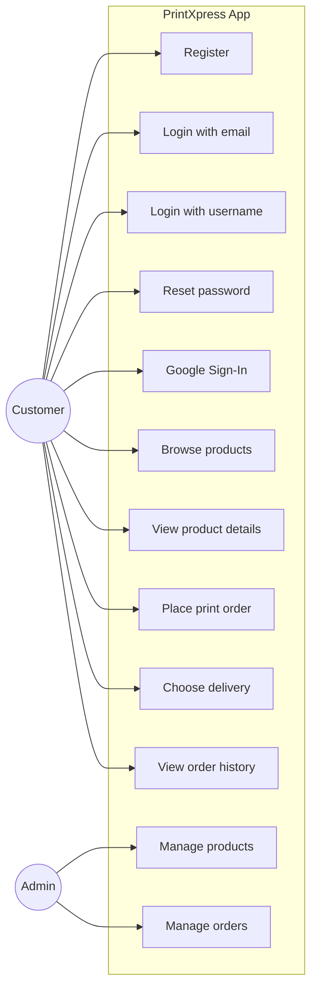
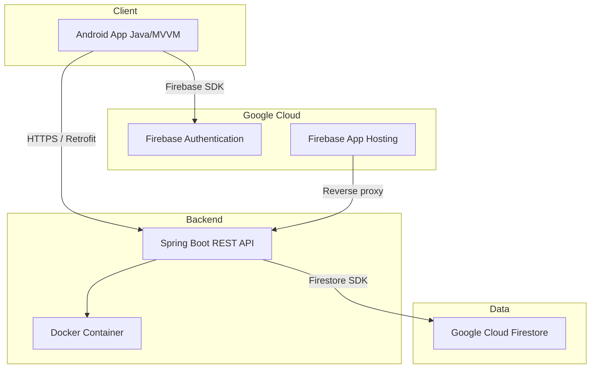
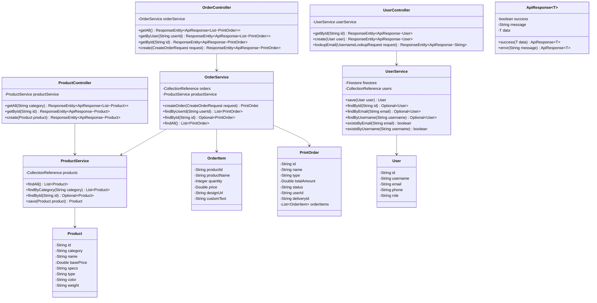
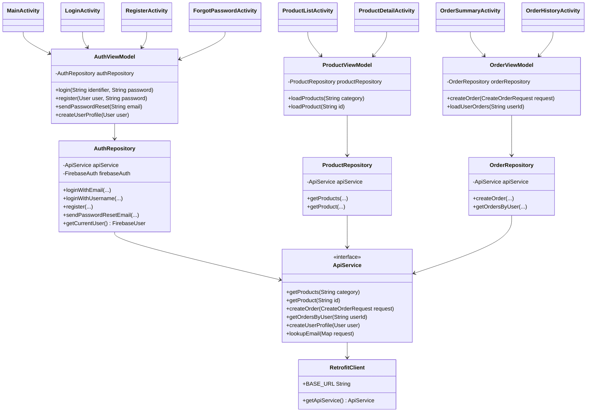
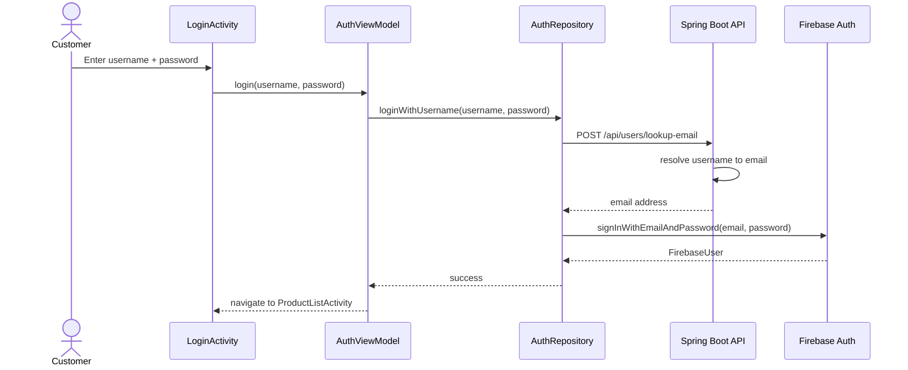
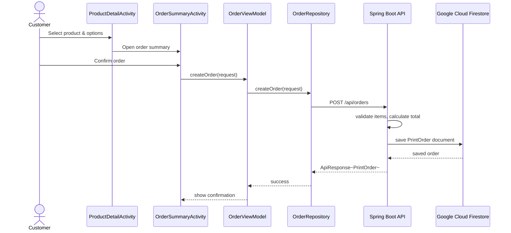
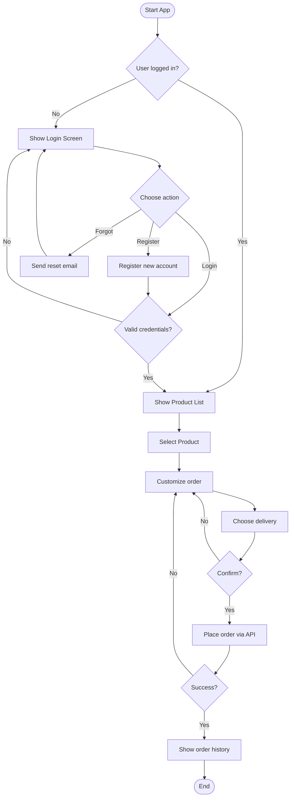
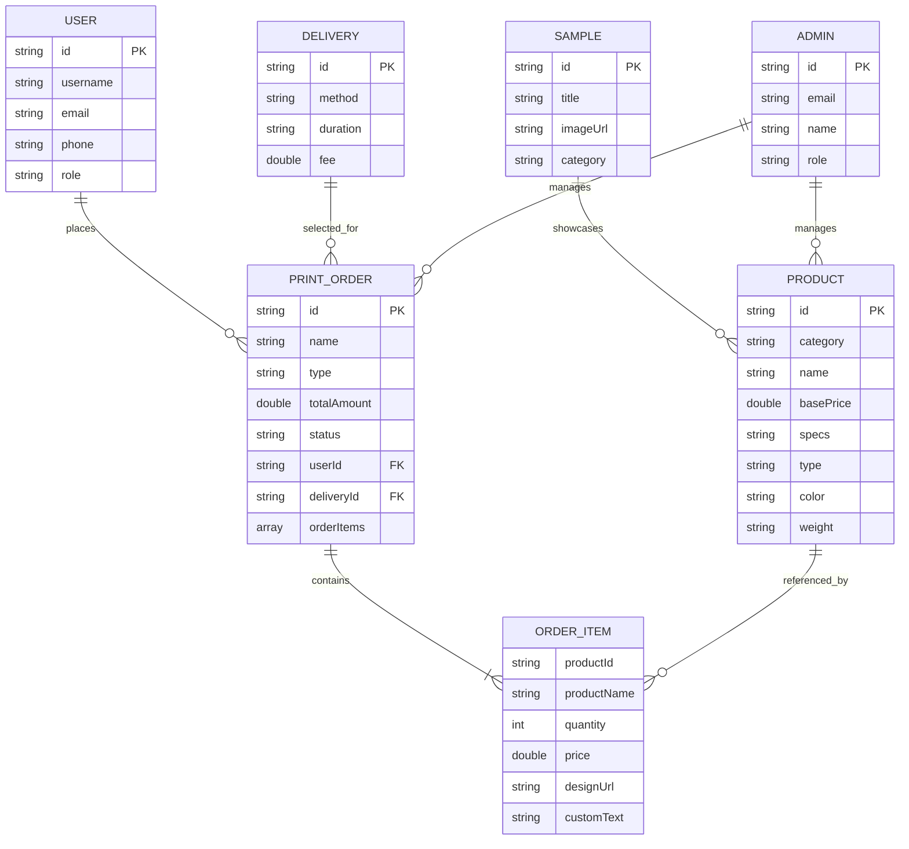
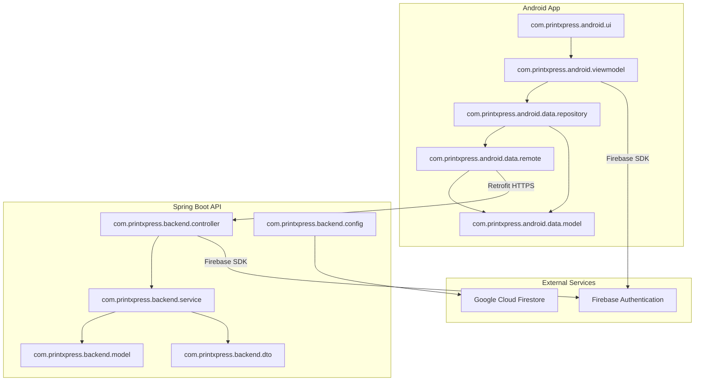

# PrintXpress — Digital Printing Service App

Native Android (Java) client + Java Spring Boot backend for a digital printing service.

## Table of Contents

- [Introduction](#introduction)
- [Features](#features)
- [Project Structure](#project-structure)
- [Architecture](#architecture)
- [Technology Stack](#technology-stack)
- [Workflow](#workflow)
- [UML Diagrams](#uml-diagrams)
  - [Use Case Diagram](#use-case-diagram)
  - [System Architecture Diagram](#system-architecture-diagram)
  - [Class Diagram](#class-diagram)
  - [Sequence Diagrams](#sequence-diagrams)
  - [Activity Diagram](#activity-diagram)
  - [Data Model / ER Diagram](#data-model--er-diagram)
  - [Package Diagram](#package-diagram)
- [API Endpoints](#api-endpoints)
- [Backend Setup](#backend-setup)
- [Backend Deployment](#backend-deployment)
- [Android Setup](#android-setup)
- [Screenshots](#screenshots)
- [Required Firebase / Google Cloud Info](#required-firebase--google-cloud-info)

---

## Introduction

**PrintXpress** is a mobile-first digital printing marketplace. Customers can browse print products (business cards, flyers, banners, mugs, etc.), customize their order, choose a delivery method, and track order history. The Android app communicates with a Spring Boot REST API backed by Google Cloud Firestore. Authentication is handled by Firebase Authentication, supporting email/password, username login, and Google Sign-In.

---

## Features

- **Firebase Authentication**
  - Register with email and password
  - Login with email **or** username
  - Forgot / reset password
  - Google Sign-In
- **Product browsing**
  - View product list by category
  - View product details and specifications
- **Order placement**
  - Select product, quantity, design file, custom text
  - Choose delivery option
  - Calculate total amount automatically
- **Order history**
  - View past orders and their status
- **Validation**
  - Client-side validation in Activities / ViewModels
  - Server-side validation in Spring Boot controllers and services
- **Architecture**
  - MVVM pattern on Android
  - Repository pattern for data access
  - LiveData / MutableLiveData for UI updates
  - Retrofit with Gson for REST communication

---

## Project Structure

```
Asna_app/
├── backend/                  # Spring Boot REST API
│   └── src/main/java/com/printxpress/backend/
│       ├── controller/       # REST controllers
│       ├── service/          # Business logic
│       ├── model/            # Firestore entities
│       ├── dto/              # Request/response objects
│       └── config/           # Firestore / security config
├── android/                  # Native Android Java app
│   └── app/src/main/java/com/printxpress/android/
│       ├── ui/               # Activities and Adapters
│       ├── viewmodel/        # MVVM ViewModels
│       ├── data/
│       │   ├── model/        # POJOs
│       │   ├── repository/   # Data repositories
│       │   └── remote/       # Retrofit API service
│       └── MainActivity.java
├── app-icon.jpg
├── screen.png
└── README.md
```

---

## Architecture

- **Android client**: Java, MVVM, Retrofit/Gson, LiveData, Firebase Authentication
- **Backend**: Java Spring Boot, REST APIs
- **Database**: Google Cloud Firestore (NoSQL document store)
- **Authentication**: Firebase Authentication
- **Hosting**: Firebase App Hosting / Google Cloud Run

---

## Technology Stack

| Layer | Technology |
|-------|------------|
| Mobile OS | Android 7.0+ (API 24+) |
| Mobile Language | Java |
| Mobile Architecture | MVVM |
| Networking | Retrofit 2, OkHttp, Gson |
| UI Components | RecyclerView, ConstraintLayout, Material Design |
| Authentication | Firebase Auth, Google Sign-In |
| Backend Framework | Spring Boot 3 |
| Backend Language | Java 17+ |
| Database | Google Cloud Firestore |
| Containerization | Docker |
| Cloud Hosting | Firebase App Hosting / Google Cloud Run |

---

## Workflow

1. **Launch** the app → `MainActivity` checks the current Firebase user.
2. **Unauthenticated user** is redirected to `LoginActivity`.
3. From `LoginActivity`, user can:
   - Sign in with email or username
   - Register a new account
   - Reset password
   - Use Google Sign-In
4. After login, user reaches `ProductListActivity`.
5. User selects a product → `ProductDetailActivity`.
6. User customizes the order and taps **Order** → `OrderSummaryActivity`.
7. User selects delivery option and confirms → order is sent to backend.
8. Backend stores the order in Firestore and returns the created order.
9. User can view all previous orders in `OrderHistoryActivity`.

---

## UML Diagrams

### Use Case Diagram



### System Architecture Diagram



### Class Diagram

#### Backend (Spring Boot)



#### Android Client



### Sequence Diagrams

#### 1. Login with Username



#### 2. Place an Order



### Activity Diagram



### Data Model / ER Diagram



### Package Diagram



---

## API Endpoints

| Method | Endpoint | Description |
|--------|----------|-------------|
| GET | `/api/products?category={category}` | List all products or filter by category |
| GET | `/api/products/{id}` | Get product details |
| POST | `/api/products` | Create a new product (admin) |
| POST | `/api/orders` | Create a new print order |
| GET | `/api/orders/user/{userId}` | Get orders for a specific user |
| GET | `/api/orders/{id}` | Get order by ID |
| GET | `/api/deliveries` | List delivery options |
| GET | `/api/samples` | List sample designs |
| POST | `/api/users` | Create or update user profile |
| GET | `/api/users/{id}` | Get user profile by ID |
| POST | `/api/users/lookup-email` | Resolve username to email |

---

## Backend Setup

1. Create a Firebase project and enable Firestore.
2. Download your service account key (Firebase Console → Project Settings → Service Accounts →
   Generate new private key) and set the environment variable:
   ```bash
   export GOOGLE_APPLICATION_CREDENTIALS="/path/to/serviceAccountKey.json"
   ```
   On Cloud Run / App Hosting the default service account is used automatically.
   **Never commit this file** — it's already covered by `.gitignore`.
3. Run (uses the bundled Gradle wrapper, no local Gradle install needed):
   ```bash
   cd backend
   ./gradlew bootRun
   ```
   On Windows:
   ```powershell
   cd backend
   .\gradlew.bat bootRun
   ```
4. Optional: to populate a few sample products on first run (when Firestore has none yet), set
   `SEED_DATA=true`:
   ```bash
   SEED_DATA=true ./gradlew bootRun
   ```

---

## Backend Deployment

1. Build the Docker image:
   ```bash
   cd backend
   docker build -t printxpress-backend .
   ```
2. Push to Google Artifact Registry and deploy to Cloud Run / Firebase App Hosting.
3. Note the HTTPS URL and update `RetrofitClient.BASE_URL` in the Android app.

---

## Android Setup

1. In the Firebase console, add an Android app and download `google-services.json`.
2. Add your SHA-1 fingerprint to the Firebase Android app (see SHA-1 section below).
3. In Firebase Console → Authentication → Sign-in method, enable **Email/Password** and **Google**.
4. Place `google-services.json` in `android/app/`.
5. `BASE_URL` in `android/app/src/main/java/com/printxpress/android/data/remote/RetrofitClient.java`
   defaults to `http://10.0.2.2:8080/`, the Android emulator's alias for your machine's localhost —
   this works out of the box against a locally running backend (`./gradlew bootRun` in `backend/`).
   For a physical device or a deployed backend, change it to your Cloud Run / Firebase App Hosting
   HTTPS URL (must end in `/`).
6. Open the `android` folder in Android Studio and run the app, or use Gradle from the command line:
   ```bash
   cd android
   ./gradlew installDebug
   ```
   On Windows:
   ```powershell
   cd android
   .\gradlew.bat installDebug
   ```

### Get your SHA-1 fingerprint (Windows)

Open PowerShell or Command Prompt and run:

```bash
cd %USERPROFILE%\.android
keytool -list -v -keystore debug.keystore -alias androiddebugkey -storepass android -keypass android
```

Or in Android Studio: open the Gradle panel, run:

```
android > Tasks > android > signingReport
```

Copy the **SHA-1** value (not SHA-256) and paste it into your Firebase Android app settings.

---

## Screenshots

<p align="center">
  
  
</p>

---

## Required Firebase / Google Cloud Info

Before running you need:
- Firebase project ID
- `google-services.json` for Android
- Firestore database created in Native mode
- Cloud Run / Firebase App Hosting URL for the backend

---

## Author

**Fathima Asna** — ICBT MAD Assignment
