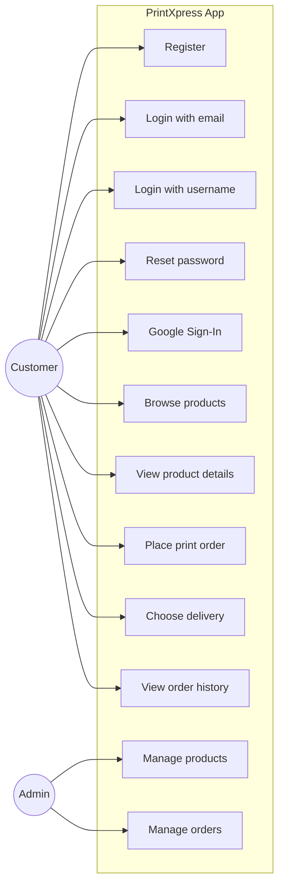
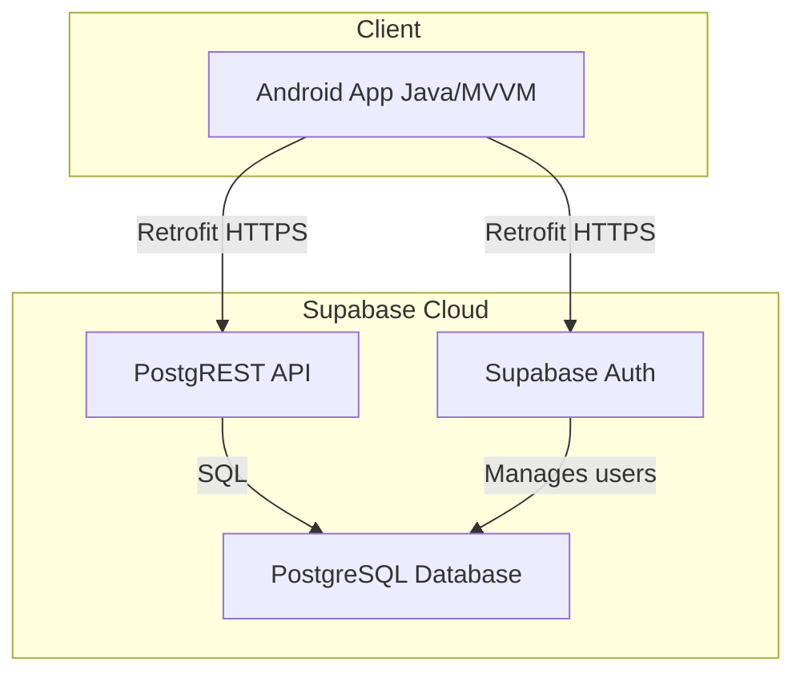
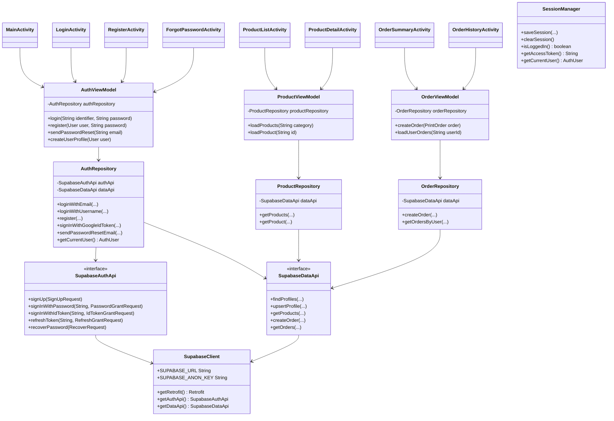
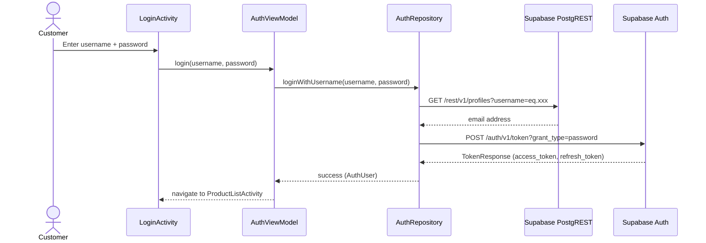
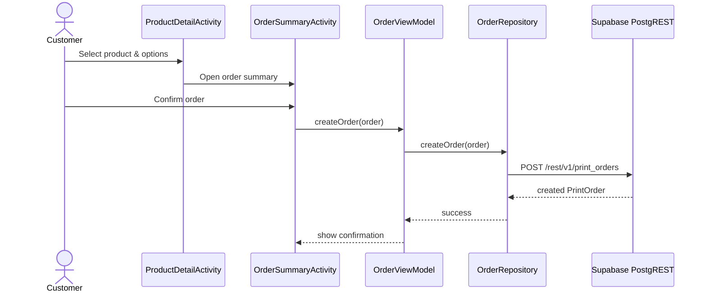
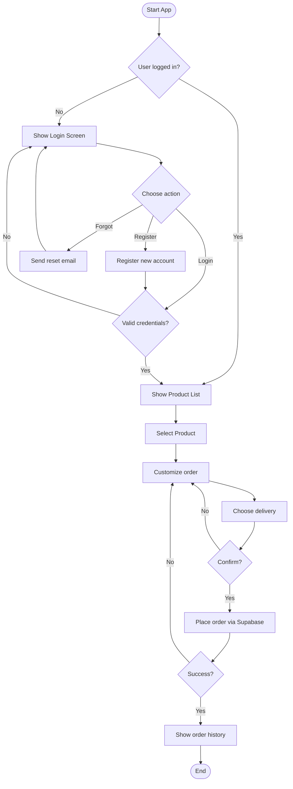
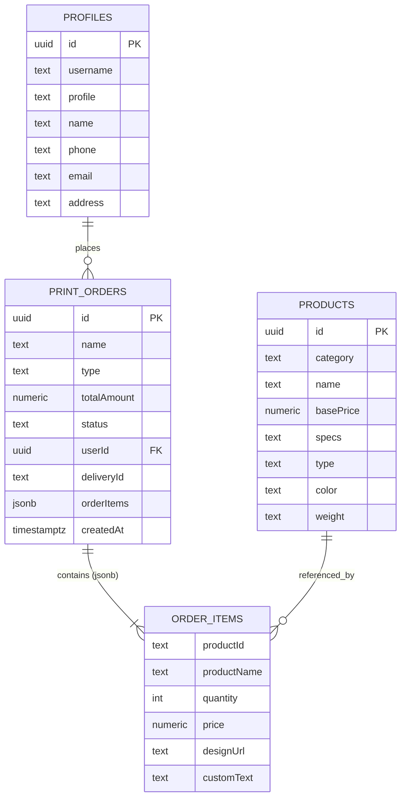

# PrintXpress — Digital Printing Service App

Native Android (Java) mobile application for a digital printing service, powered by Supabase.

## Table of Contents

- [Introduction](#introduction)
- [Features](#features)
- [Project Structure](#project-structure)
- [Architecture](#architecture)
- [Technology Stack](#technology-stack)
- [Workflow](#workflow)
- [UML Diagrams](#uml-diagrams)
  - [Use Case Diagram](#use-case-diagram)
  - [System Architecture Diagram](#system-architecture-diagram)
  - [Class Diagram](#class-diagram)
  - [Sequence Diagrams](#sequence-diagrams)
  - [Activity Diagram](#activity-diagram)
  - [Data Model / ER Diagram](#data-model--er-diagram)
  - [Package Diagram](#package-diagram)
- [Supabase Setup](#supabase-setup)
- [Android Setup](#android-setup)
- [Screenshots](#screenshots)

---

## Introduction

**PrintXpress** is a mobile-first digital printing marketplace. Customers can browse print products (business cards, flyers, banners, posters, etc.), customize their order, choose a delivery method, and track order history. The Android app communicates directly with Supabase for both authentication and data storage, using Supabase Auth REST API for email/password and Google Sign-In, and the Supabase PostgREST API for CRUD operations on a PostgreSQL database.

---

## Features

- **Supabase Authentication**
  - Register with email and password
  - Login with email **or** username
  - Forgot / reset password
  - Google Sign-In via Supabase `id_token` grant
  - Session management with automatic token refresh
- **Product browsing**
  - View product list by category
  - View product details and specifications
- **Order placement**
  - Select product, quantity, design file, custom text
  - Choose delivery option
  - Calculate total amount automatically
- **Order history**
  - View past orders and their status
- **Validation**
  - Client-side validation in Activities / ViewModels
- **Architecture**
  - MVVM pattern on Android
  - Repository pattern for data access
  - LiveData / MutableLiveData for UI updates
  - Retrofit for Supabase REST API communication

---

## Project Structure

```
Asna_app/
├── android/                  # Native Android Java app
│   └── app/src/main/java/com/printxpress/android/
│       ├── ui/               # Activities and Adapters
│       ├── viewmodel/        # MVVM ViewModels
│       ├── data/
│       │   ├── model/        # POJOs
│       │   ├── repository/   # Data repositories
│       │   └── remote/       # Supabase API interfaces & client
│       ├── util/             # SessionManager, ValidationUtils
│       ├── PrintXpressApp.java
│       └── MainActivity.java
├── supabase_setup.sql        # Database schema & seed data
├── app-icon.jpg
├── screen.png
└── README.md
```

---

## Architecture

- **Android client**: Java, MVVM, Retrofit/Gson, LiveData, Supabase Auth
- **Backend**: Supabase (hosted PostgreSQL + Auth + PostgREST)
- **Database**: PostgreSQL via Supabase
- **Authentication**: Supabase Auth (email/password, Google Sign-In)

---

## Technology Stack

| Layer | Technology |
|-------|------------|
| Mobile OS | Android 7.0+ (API 24+) |
| Mobile Language | Java |
| Mobile Architecture | MVVM |
| Networking | Retrofit 2, OkHttp, Gson |
| UI Components | RecyclerView, ConstraintLayout, Material Design |
| Authentication | Supabase Auth, Google Sign-In |
| Database | PostgreSQL (Supabase) |
| API Layer | Supabase PostgREST |

---

## Workflow

1. **Launch** the app → `MainActivity` checks for an existing session.
2. **Unauthenticated user** is redirected to `LoginActivity`.
3. From `LoginActivity`, user can:
   - Sign in with email or username
   - Register a new account
   - Reset password
   - Use Google Sign-In
4. After login, user reaches `ProductListActivity`.
5. User selects a product → `ProductDetailActivity`.
6. User customizes the order and taps **Order** → `OrderSummaryActivity`.
7. User selects delivery option and confirms → order is saved via Supabase.
8. User can view all previous orders in `OrderHistoryActivity`.

---

## UML Diagrams

### Use Case Diagram



### System Architecture Diagram



### Class Diagram

#### Android Client



### Sequence Diagrams

#### 1. Login with Username



#### 2. Place an Order



### Activity Diagram



### Data Model / ER Diagram



### Package Diagram


---

## Supabase Setup

1. Create a free project on [supabase.com](https://supabase.com).
2. In the Supabase Dashboard, go to **SQL Editor → New query**, paste the contents of
   [`supabase_setup.sql`](supabase_setup.sql), and click **Run**. This creates the
   `profiles`, `products`, and `print_orders` tables with Row Level Security (RLS) policies
   and seeds four sample products.
3. In **Authentication → Providers**, enable:
   - **Email** (with or without "Confirm email" — the app handles both flows)
   - **Google** (paste your Google OAuth Client ID and Secret)
4. Note your **Project URL** and **anon/public key** from **Settings → API**.

---

## Android Setup

1. Open the `android` folder in Android Studio.
2. Update `SupabaseClient.java` with your Supabase project URL and anon key:
   ```java
   public static final String SUPABASE_URL = "https://YOUR_PROJECT.supabase.co/";
   public static final String SUPABASE_ANON_KEY = "YOUR_ANON_KEY";
   ```
3. For Google Sign-In, add your **Web Client ID** (from Google Cloud Console) to
   `res/values/strings.xml`:
   ```xml
   <string name="default_web_client_id">YOUR_WEB_CLIENT_ID</string>
   ```
4. Build and run:
   ```bash
   cd android
   ./gradlew installDebug
   ```
   On Windows:
   ```powershell
   cd android
   .\gradlew.bat installDebug
   ```

---

## Screenshots

<p align="center">
  
  
</p>

---

## Author

**Fathima Asna** — ICBT MAD Assignment
